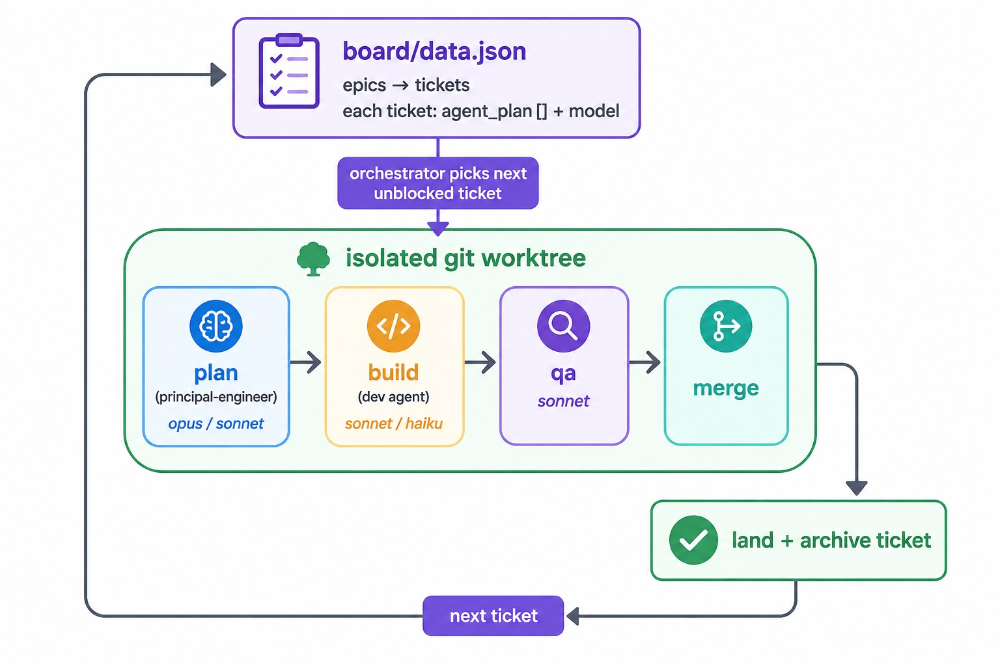

<p align="center">
  
</p>

<h1 align="center">Maestro</h1>

<p align="center"><b>Conduct a roster of AI coding agents against a work board.</b></p>

Maestro runs software delivery as an *orchestra* of AI agents instead of a single chat
session. The idea in three sentences:

1. You keep a **board** of epics and tickets.
2. Every ticket declares **which agents work it** (a pipeline like `plan → build → qa → merge`) and **which model** each stage runs on.
3. An **orchestrator** picks the next unblocked ticket, runs it through that pipeline in an isolated git worktree, gates it, lands it — then moves to the next one.

It's the distilled, product-neutral version of a system I've been running across a
multi-repo portfolio for months. This repo shares the structure so you can adopt the
same way of working.

### How it flows



## Why work this way

- **The board is the source of truth, not the chat.** Work survives context resets,
  handoffs, and parallel sessions because it lives in `board/data.json`, not in a
  conversation you'll lose.
- **The right agent and model per task.** A one-line CSS fix and a database migration
  should not run on the same model or the same prompt. Tickets route themselves.
- **Pipelines, not heroics.** Every ticket flows plan → build → review → merge. Review
  and delivery gates are structural, not something you remember to do.
- **Isolated by construction.** Each ticket runs in its own git worktree, so parallel
  work never collides and a bad branch never dirties `main`.
- **Reusable skills.** Git branch conventions, worktree cleanup, landing a change,
  catching up a stale checkout, validating the board — packaged once, used everywhere.

## What's in the box

| Piece | What it is |
| --- | --- |
| [`board/`](./board/) | The board format (`board.schema.json`) + a runnable example board |
| [`agents/`](./agents/) | A generic agent roster: orchestrator, principal-engineer, backend, frontend, devops, qa, principal-delivery |
| [`skills/`](./skills/) | Reusable skills — board hygiene, release gate, security review, and the git/worktree basics |
| [`render/`](./render/) | `sync.mjs` — generates a project's `.claude/` from its config + context |
| [`starters/`](./starters/) | Two starter capsules: full orchestrated project, or a lightweight single-area one |
| [`cockpit/`](./cockpit/) | A React/MUI board console — config-driven pickers, epic + ticket editing, a roster view, validated + conflict-safe writes |
| [`bin/cli.mjs`](./bin/cli.mjs) | The `maestro` CLI — `setup` / `init` (interactive setup), `sync`, `validate` |
| [`Makefile`](./Makefile) | `make board` (set up + open the console), `make setup` / `sync` / `validate` |
| [`docs/`](./docs/) | The method, model-routing policy, and a getting-started guide |

## Quickstart

Clone Maestro **into your project** and run one command:

```bash
cd ~/code/my-app                                          # your project
git clone https://github.com/spourali/maestro.git maestro
cd maestro
make board            # first run asks a couple of questions, then opens http://localhost:5273
```

That's it. `make board` sets up your project (name + areas), renders the agents & skills, and
opens the board console. Run it again any time to reopen the board.

Then, from a Claude Code (or compatible) session, invoke the **`orchestrator`** agent — it picks
up the first unblocked ticket and runs it. Full walkthrough:
[`docs/GETTING-STARTED.md`](./docs/GETTING-STARTED.md).

> **No `make`?** The same two steps are `node bin/cli.mjs setup` then `npm run dev`.
> **Want the kit kept separate from your project** (updated independently, reused across repos)?
> See the [alternative layout](./docs/GETTING-STARTED.md#self-contained-clone-the-kit-into-your-repo).

## The core idea in one ticket

```jsonc
{
  "id": "T-014",
  "epicId": "e2",
  "name": "Add rate limiting to the public API",
  "area": "backend",
  "priority": "P1",
  "swag": "M",
  "status": "todo",
  "depends_on": ["T-011"],
  "agent_plan": ["pe", "backend", "qa", "merge"],  // the pipeline
  "model": "sonnet"                                  // the model to run it on
}
```

The orchestrator reads that and does the rest: it won't touch `T-014` until `T-011`
is `done`; when it does, it runs a principal-engineer plan, hands the plan to the
backend agent in a fresh worktree, gates through QA, then merges and archives.

## Add Maestro to your own project

New to this? Here's the whole flow in one place. Maestro is a **sidecar** — it lives in a
`maestro/` folder inside *your* repo and never touches your application code. Adding it to a
brand-new repo or a years-old one is the same process.

```
your-repo/
├── src/  …                    ← your real code (untouched)
├── maestro/                   ← the capsule you copy in
│   ├── config.json            ← you edit: project name, areas, models
│   ├── context.md             ← you edit: the brief every agent reads
│   ├── board/data.json        ← you edit (or use the cockpit UI): epics + tickets
│   ├── agents/*.md            ← optional: your own custom agents (merged in, kept on re-render)
│   └── skills/*/SKILL.md      ← optional: your own custom skills
└── .claude/                   ← GENERATED — don't hand-edit
    ├── agents/*.md
    └── skills/*
```

**You'll need:** git, Node.js 18+, and an agentic coding tool that can run subagents
([Claude Code](https://claude.com/claude-code) or compatible).

**The one-command way** — `init` asks a few questions, copies a starter, writes `config.json`,
renders the agents/skills, and validates the board:

```bash
git clone https://github.com/spourali/maestro.git ~/maestro
cd ~/code/my-app                 # ← your repo (new or existing)
node ~/maestro/bin/cli.mjs init  # follow the prompts
```

**Or by hand**, if you'd rather see every step:

```bash
cd ~/code/my-app
cp -R ~/maestro/starters/orchestrated-project/. maestro/   # PowerShell: Copy-Item ~/maestro/starters/orchestrated-project/* maestro/ -Recurse
# edit maestro/config.json (name, areas, models) and maestro/context.md (stack, tests, guardrails)
node ~/maestro/render/sync.mjs --project ./maestro --kit ~/maestro          # re-run after any edit
node ~/maestro/scripts/validate-board.mjs maestro/board/data.json
```

Then, from your coding tool *inside the repo*, invoke the **`orchestrator`** agent — it picks
the next ready ticket, works it in an isolated worktree, gates it, and lands it (one ticket
per run, so you stay in the loop).

> **Keep your own agents/skills in one place.** Drop custom agents in `maestro/agents/` and
> skills in `maestro/skills/<name>/SKILL.md`. `sync` merges them into `.claude/` (overriding a
> kit file of the same name) and — unlike hand-editing `.claude/` — they survive every
> re-render. List them in `config.json`'s `roster` so tickets can route to them.

### Prefer everything inside one repo?

Clone the kit *into* your project and ignore it — no separate `~/maestro`, nothing external to
keep in sync:

```bash
cd ~/code/my-app
git clone https://github.com/spourali/maestro.git .maestro-kit
printf '\n# Maestro tooling (cloned in; update with git pull) + runtime\n.maestro-kit/\n.maestro/\n' >> .gitignore
node .maestro-kit/bin/cli.mjs init            # writes maestro/, points it at ../.maestro-kit
```

You commit the `maestro/` capsule and the generated `.claude/`; the kit itself stays untracked
(like `node_modules`). Update the tooling any time with `git -C .maestro-kit pull`, then
`node .maestro-kit/bin/cli.mjs sync`. Teammates who clone your repo get the working agents from
the committed `.claude/`; they only need the kit to *re-render* or open the cockpit.

👉 **Full walkthrough, jargon explained, and troubleshooting:** [`docs/GETTING-STARTED.md`](./docs/GETTING-STARTED.md).

## The cockpit

A no-terminal way to run the board: stat cards, an epic sidebar, and filterable ticket cards.
Add and edit epics and tickets in place — areas, models, and the agent pipeline are **pickers
driven by your `config.json`**, ticket IDs are generated for you, and every write is validated
before it's saved (the UI can't create a broken board). A **Roster** tab lists the agents and
skills your tickets route to. Edits land back in `board/data.json`; if an agent changes the
board while you're looking at it, the console reloads instead of overwriting their work.


<details>
<summary>More views — light theme &amp; the roster</summary>

| Board (light) | Roster (agents &amp; skills) |
| --- | --- |
|  |  |

</details>

```bash
cd ~/maestro && npm run dev   # installs cockpit deps if needed, then → http://localhost:5273
```

## Status

Early and evolving — the structure is battle-tested; the packaging is new. Issues and
ideas welcome. See [`CONTRIBUTING.md`](./CONTRIBUTING.md).

## License

MIT — see [`LICENSE`](./LICENSE).
