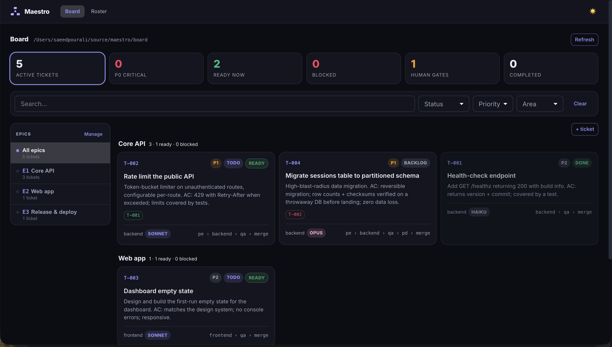
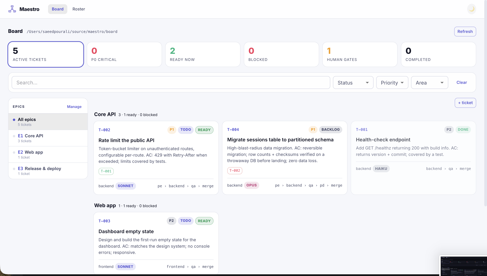
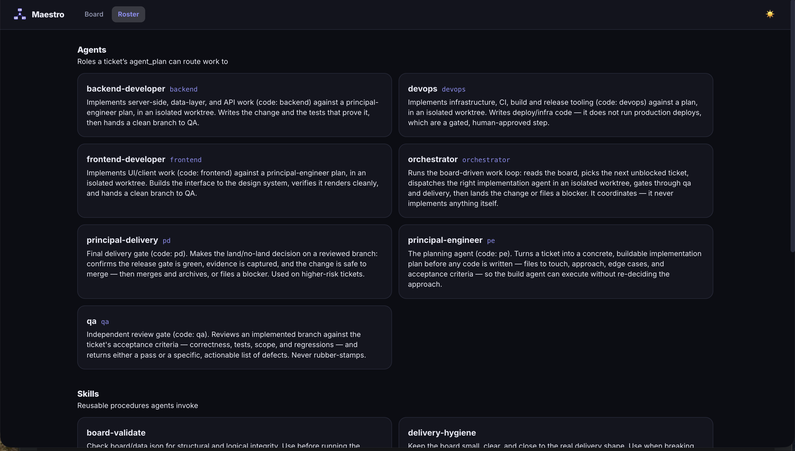

<p align="center">
  
</p>

<h1 align="center">AI Maestro</h1>

<p align="center"><b>From idea to product, you're the Maestro.</b></p>

<p align="center">Conduct a roster of AI coding agents against a work board.</p>

**AI Maestro turns AI-assisted coding from improvised chat sessions into a managed delivery
process.** Instead of one developer prompting one AI, a portfolio of specialized AI agents
works a visible board of tasks — each task routed to the right agent and the right
(cost-appropriate) model, executed in isolation, and quality-gated before it lands. The
result: AI development that is trackable, parallelizable, and safe to hand off — the
difference between hiring a freelancer and running a team.

AI Maestro runs software delivery as an *orchestra* of AI agents instead of a single chat
session. The idea in three sentences:

1. You keep a **board** of epics and tickets.
2. Every ticket declares **which agents work it** (a pipeline like `plan → build → qa → merge`) and **which model** each stage runs on.
3. An **orchestrator** picks the next unblocked ticket, runs it through that pipeline in an isolated git worktree, gates it, and lands it — **one ticket per run**, so you stay in the loop between tickets.

It's the distilled, product-neutral version of a system I've been running across a
multi-repo portfolio for months. This repo shares the structure so you can adopt the
same way of working.

### How it flows


## Why work this way

- **The board is the source of truth, not the chat.** Work survives context resets,
  handoffs, and parallel sessions because it lives in `board/data.json`, not in a
  conversation you'll lose.
- **The right agent and model per task.** A one-line CSS fix and a database migration
  should not run on the same model or the same prompt. Tickets route themselves.
- **Pipelines, not heroics.** Every ticket flows plan → build → review → merge. Review
  and delivery gates are structural, not something you remember to do.
- **Isolated by construction.** Each ticket runs in its own git worktree, so parallel
  work never collides and a bad branch never dirties `main`.
- **Reusable skills.** Git branch conventions, worktree cleanup, landing a change,
  catching up a stale checkout, validating the board — packaged once, used everywhere.

## What's in the box

| Piece | What it is |
| --- | --- |
| [`board/`](./board/) | The board format (`board.schema.json`) + a runnable example board |
| [`agents/`](./agents/) | A generic agent roster: orchestrator, principal-engineer, backend, frontend, devops, qa, principal-delivery |
| [`skills/`](./skills/) | Reusable skills — board hygiene, release gate, security review, and the git/worktree basics |
| [`render/`](./render/) | `sync.mjs` — generates a project's `.claude/` from its config + context |
| [`starters/`](./starters/) | Two starter capsules: full orchestrated project, or a lightweight single-area one |
| [`cockpit/`](./cockpit/) | A React/MUI board console — config-driven pickers, epic + ticket editing, a roster view, validated + conflict-safe writes |
| [`bin/cli.mjs`](./bin/cli.mjs) | The `maestro` CLI — `setup` (questionnaire onboarding), `sync`, `validate`, `init` |
| [`docs/`](./docs/) | The method, model-routing policy, and a getting-started guide |


## Quickstart

Three ways in — pick one:

- **[Path 1 — Instant Setup with npx](#path-1--instant-setup-with-npx)**: run the questionnaire yourself, then do the [first steps](#first-steps-after-setup).
- **[Path 2 — Hands-Free Onboarding with Claude Code](#path-2--hands-free-onboarding-with-claude-code)**: paste one prompt; Claude runs setup and fills things in for you.
- **[Path 3 — Global Install or Git Clone](#path-3--global-install-or-git-clone)**: a permanent global install, or a git clone.

### Path 1 — Instant Setup with npx

One command in your project — no clone, no install:

```bash
cd ~/code/my-app     # your project
npx @mychiefmind/ai-maestro setup # asks project name + areas
```

`setup` copies the kit into `./maestro/`, writes your config, and renders the agents & skills
into `./.claude/` at your repo root, then **asks if you'd like to open the visual board** (say
no and nothing is left running). Now open the repo in Claude Code and ask the **`orchestrator`**
agent to start; it picks up the first unblocked ticket and runs it.

### Path 2 — Hands-Free Onboarding with Claude Code

Prefer not to run the questionnaire by hand? Open your project in
[Claude Code](https://claude.com/claude-code) (or a compatible agentic tool) and paste this
prompt — it runs `setup`, fills in your `context.md` from the real codebase, and seeds a few
starter tickets for you to review:

```text
Add AI Maestro — the AI-agent orchestration kit — to this project.

1. From the repo root, run: npx @mychiefmind/ai-maestro setup
   It's interactive: it asks for a project name and the areas of this
   codebase (e.g. frontend, backend, infra). Infer sensible answers from
   the repo, but show them to me before you commit to them.
   This vendors the kit into ./maestro/ and renders agents + skills into
   ./.claude/ at the repo root. It must NOT touch my application code.

2. Fill in maestro/context.md — the brief every agent reads. Summarize
   what this project is, its stack, key conventions, and how to run and
   test it, drawn from the ACTUAL codebase (README, package manifests,
   configs) — not guesses.

3. Seed maestro/board/data.json with a few real starter tickets based on
   obvious near-term work you can see (TODOs, missing tests, rough edges).
   Keep them status: "todo" and let me review before anything runs.

4. Report back: the areas you chose, the agent roster, and whether I
   should commit maestro/ or gitignore it.

Do NOT start executing tickets. Stop after setup so I can review — then
I'll invoke the `orchestrator` agent myself.
```

### Path 3 — Global Install or Git Clone

#### Global install

Prefer a permanent install? `npm i -g @mychiefmind/ai-maestro` gives you the CLI as both
`ai-maestro` and the short **`maestro`** command.

#### Git clone

Prefer git? Cloning gives the identical layout:

```bash
cd ~/code/my-app
git clone https://github.com/my-chiefmind/ai-maestro.git maestro
cd maestro && npm run setup
```

### First steps after setup

Open your project in Claude Code and run these once, in order:

1. **`/init`** — regenerates `CLAUDE.md` so Claude maps your actual codebase (stack,
   conventions, how to run and test it).
2. Once you've had a look at the board, prompt:

   ```text
   fill in maestro/context.md with the real project details
   ```

   `context.md` is the brief every agent reads — this replaces the placeholder with facts
   drawn from your codebase.
3. Then prompt:

   ```text
   clear the example tickets from the board
   ```

   The board ships with example tickets so you can see the format; this removes them so
   you start from a clean board.

### Going further

Full walkthrough, layouts, and troubleshooting: [`docs/GETTING-STARTED.md`](./docs/GETTING-STARTED.md).

## The visual board (optional)

**Want the visual board?** It's optional (the only part that runs a server) and ships with both
paths — `npx setup` vendors it into your `maestro/` folder, and a clone has it too. `setup`
offers to open it for you at the end; you can also start it any time:

```bash
npm run board      # from the maestro/ folder — installs the cockpit's deps on first run, then → http://localhost:5273
```

## The core idea in one ticket

```jsonc
{
  "id": "T-014",
  "epicId": "e2",
  "name": "Add rate limiting to the public API",
  "area": "backend",
  "priority": "P1",
  "swag": "M",
  "status": "todo",
  "depends_on": ["T-011"],
  "agent_plan": ["pe", "backend", "qa", "merge"],  // the pipeline
  "model": "sonnet"                                  // the model to run it on
}
```

The orchestrator reads that and does the rest: it won't touch `T-014` until `T-011`
is `done`; when it does, it runs a principal-engineer plan, hands the plan to the
backend agent in a fresh worktree, gates through QA, then merges and archives.

## How it sits in your project

After `setup`, AI Maestro is a **sidecar** — the tooling lives in `maestro/` and never touches your
application code, and the generated agents land at your **repo root** so the coding tool
discovers them.

```
my-app/
├── src/  …                    ← your real code (untouched)
├── maestro/                   ← the cloned kit + your settings
│   ├── config.json            ← project name, areas, models   (setup writes this)
│   ├── context.md             ← the brief every agent reads    (you fill in)
│   ├── board/data.json        ← epics + tickets (edit here or in the cockpit)
│   ├── agents/*.md            ← optional: your own custom agents (merged in, kept on re-render)
│   └── skills/*/SKILL.md      ← optional: your own custom skills
├── .claude/                   ← GENERATED — agents & skills (don't hand-edit)
└── CLAUDE.md                  ← GENERATED — project brief
```

**You'll need:** git, Node.js 18+, and an agentic coding tool that can run subagents
([Claude Code](https://claude.com/claude-code) or compatible). Setup is the single command from
the [Quickstart](#quickstart) — `cd maestro && npm run setup` — then invoke the
**`orchestrator`** agent from your coding tool at the repo root.

> **Keep your own agents/skills in one place.** Drop custom agents in `maestro/agents/` and
> skills in `maestro/skills/<name>/SKILL.md`. `sync` merges them into `.claude/` (overriding a
> kit file of the same name) and — unlike hand-editing `.claude/` — they survive every
> re-render. List them in `config.json`'s `roster` so tickets can route to them.

> **Keep the kit out of your project's git?** (`npx @mychiefmind/ai-maestro setup` vendors a plain folder —
> just commit it or ignore it.) A cloned kit has its own `.git`. Either `rm -rf maestro/.git`
> to vendor it as a plain folder, or add `maestro/` to your `.gitignore` (then commit `.claude/`
> and `CLAUDE.md`, which sit at your root). Update later with `git -C maestro pull` then `sync`.

For the alternative layout — one shared kit serving several repos, via `maestro init` — see
👉 [`docs/GETTING-STARTED.md`](./docs/GETTING-STARTED.md).

## The cockpit

A no-terminal way to run the board: stat cards, an epic sidebar, and filterable ticket cards.
Add and edit epics and tickets in place — areas, models, and the agent pipeline are **pickers
driven by your `config.json`**, ticket IDs are generated for you, and every write is validated
before it's saved (the UI can't create a broken board). A **Roster** tab lists the agents and
skills your tickets route to. Edits land back in `board/data.json`; if an agent changes the
board while you're looking at it, the console reloads instead of overwriting their work.



<details>
<summary>More views — light theme &amp; the roster</summary>

| Board (light) | Roster (agents &amp; skills) |
| --- | --- |
|  |  |

</details>

```bash
cd maestro && npm run board   # installs the cockpit's deps if needed, then → http://localhost:5273
```

## Status

Early and evolving — the structure is battle-tested; the packaging is new. Issues and
ideas welcome. See [`CONTRIBUTING.md`](./CONTRIBUTING.md).

## License

MIT — see [`LICENSE`](./LICENSE).
