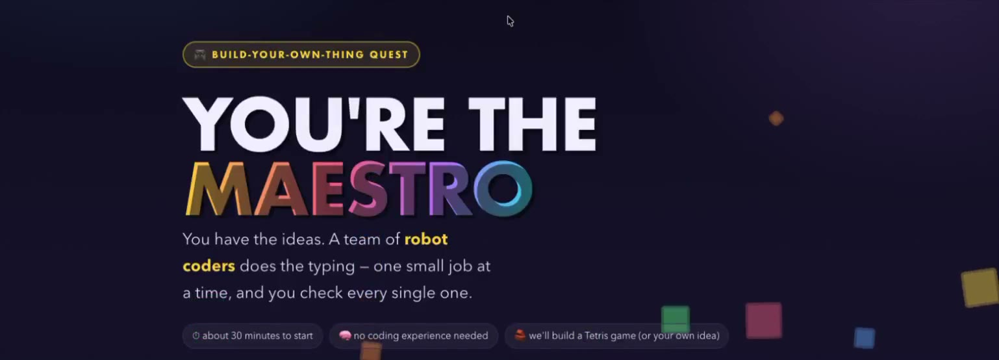
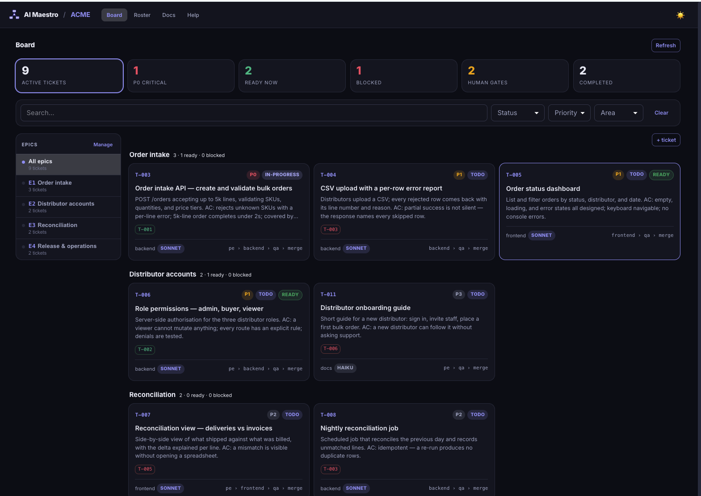
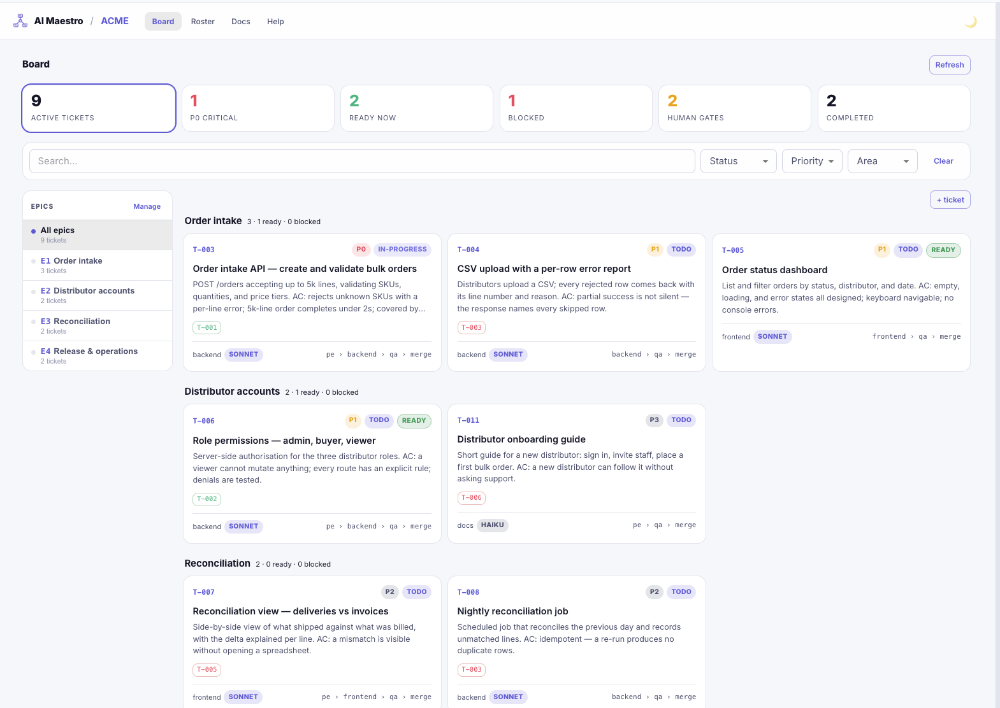
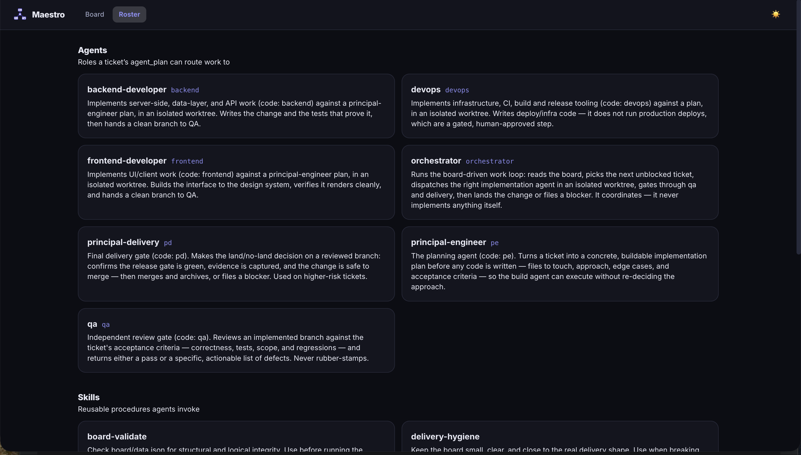

<p align="center">
  
</p>

<h1 align="center">AI Maestro</h1>

<p align="center"><b>From idea to product, you're the Maestro.</b></p>

<p align="center">Conduct a roster of AI coding agents against a work board.</p>

<p align="center">
  <code>npm&nbsp;@mychiefmind/ai-maestro</code> ·
  <code>Node&nbsp;18+</code> ·
  <code>0&nbsp;runtime&nbsp;deps</code> ·
  <a href="./LICENSE"><code>MIT</code></a> ·
  <a href="./SECURITY.md"><code>Security</code></a>
</p>

<p align="center">
  <a href="#quickstart">Quickstart</a> ·
  <a href="#whats-in-the-box">What's in the box</a> ·
  <a href="#the-cockpit">Visual board</a> ·
  <a href="#how-it-sits-in-your-project">Project layout</a> ·
  <a href="./docs/GETTING-STARTED.md">Docs</a>
</p>

---

> **AI Maestro turns AI-assisted coding from improvised chat sessions into a managed
> delivery process.** Instead of one developer prompting one AI, a portfolio of specialized
> AI agents works a visible board of tasks — each task routed to the right agent and the
> right (cost-appropriate) model, executed in isolation, and quality-gated before it lands.
> The result: AI development that is trackable, parallelizable, and safe to hand off — the
> difference between hiring a freelancer and running a team.

[](https://mychiefmind.com/ai-maestro/demo)

AI Maestro runs software delivery as an *orchestra* of AI agents instead of a single chat
session. The idea in three sentences:

| # | The idea |
| :--: | --- |
| **1** | You keep a **board** of epics and tickets. |
| **2** | Every ticket declares **which agents work it** (a pipeline like `plan → build → qa → merge`) and **which model** each stage runs on. |
| **3** | An **orchestrator** picks the next unblocked ticket, runs it through that pipeline in an isolated git worktree, gates it, and lands it — **one ticket per run**, so you stay in the loop between tickets. |

It's the distilled, product-neutral version of a system I've been running across a
multi-repo portfolio for months. This repo shares the structure so you can adopt the
same way of working.

### How it flows


## Why work this way

| Principle | What it buys you |
| --- | --- |
| **The board is the source of truth, not the chat.** | Work survives context resets, handoffs, and parallel sessions because it lives in `board/data.json`, not in a conversation you'll lose. |
| **The right agent and model per task.** | A one-line CSS fix and a database migration should not run on the same model or the same prompt. Tickets route themselves. |
| **Pipelines, not heroics.** | Every ticket flows through its configured agent pipeline, followed by the required review and delivery gates. Those gates are structural, not something you remember to do. |
| **Isolated by construction.** | Each ticket runs in its own git worktree, so parallel work never collides and a bad branch never dirties `main`. |
| **Reusable skills.** | Git branch conventions, worktree cleanup, landing a change, catching up a stale checkout, validating the board — packaged once, used everywhere. |

## What's in the box

| Piece | What it is |
| --- | --- |
| [`board/`](./board/) | The board format (`board.schema.json`) + this repo's own workboard. A runnable example board ships in [`starters/orchestrated-project/board/`](./starters/orchestrated-project/board/) instead — that's what `setup` seeds a new project from, never this one's. |
| [`agents/`](./agents/) | A generic agent roster: orchestrator, principal-engineer, backend, frontend, devops, technical-writer, qa, principal-delivery |
| [`skills/`](./skills/) | Reusable skills — the `/project-plan` and `/orchestrator` entry points, plus board hygiene, release gate, security review, and the git/worktree basics |
| [`render/`](./render/) | `sync.mjs` — generates a project's `.claude/` from its config + context; `--all --registry <file>` does it across every project in a [registry](./docs/GETTING-STARTED.md#managing-several-projects) |
| [`starters/`](./starters/) | Two starter capsules: full orchestrated project, or a lightweight single-area one |
| [`cockpit/`](./cockpit/) | A React/MUI board console — config-driven pickers, epic + ticket editing, a roster view, validated + conflict-safe writes |
| [`bin/cli.mjs`](./bin/cli.mjs) | The `maestro` CLI — `setup` (questionnaire onboarding), `sync`, `validate`, `drift`, `init` |
| [`scripts/registry.mjs`](./scripts/registry.mjs) | The shared registry format behind `maestro drift` and `sync --all` — see [Managing several projects](./docs/GETTING-STARTED.md#managing-several-projects) |
| [`docs/`](./docs/) | The method, model-routing policy, and a getting-started guide |

## Quickstart

Two ways in — pick one:

| Path | What it is | Command |
| --- | --- | --- |
| **[1 — Instant Setup with npx](#path-1--instant-setup-with-npx)** | Run the questionnaire yourself, then do the [first steps](#first-steps-after-setup). | `npx @mychiefmind/ai-maestro setup` |
| **[2 — Hands-Free Onboarding with Claude Code](#path-2--hands-free-onboarding-with-claude-code)** | Paste one prompt; Claude runs setup and fills things in for you. | *(the prompt is below)* |

Starting from an empty folder, or showing someone else how this works? The
**[new-project demo](https://mychiefmind.com/ai-maestro/demo)** walks the whole path in plain
language, written for a complete beginner — install, answer a few questions about your project,
review the generated epics and dependency-ordered tickets, then run the orchestrator.

### Path 1 — Instant Setup with npx

One command in your project — no clone, no install:

```bash
cd ~/code/my-app     # your project
npx @mychiefmind/ai-maestro setup # asks about your project; Enter accepts every default
```

`setup` asks for your project brief — outcome, users, stack, constraints, and how to run and
test it — then copies the kit into `./maestro/`, writes your `config.json` + `context.md` from
those answers, runs `git init` if the folder isn't a repo yet, renders the agents & skills into
`./.claude/` at your repo root, checks the board, and **asks if you'd like to open the visual
board** (say no and nothing is left running). The six project-brief questions default to
`propose one`, which hands those decisions to the agents and has them show you what they chose;
the project name and work areas have concrete defaults.

Now open the repo in Claude Code and run **`/project-plan`** — you get epics and
dependency-ordered tickets to review. Approve them, then run **`/orchestrator`**; it picks up the
first unblocked ticket and runs it. (Plain language works too: "plan the project", "run the
board".)

### Path 2 — Hands-Free Onboarding with Claude Code

Prefer not to answer the questionnaire yourself? Open your project in
[Claude Code](https://claude.com/claude-code) (or a compatible agentic tool) and paste this
prompt — it runs `setup` with answers drawn from your real codebase, then plans a board for you
to review:

```text
Add AI Maestro — the AI-agent orchestration kit — to this project.

1. From the repo root, run setup non-interactively, filling each answer
   from the ACTUAL codebase (README, package manifests, configs) — not
   guesses. Show me the answers before you run it:

   npx @mychiefmind/ai-maestro setup --yes --no-board \
     --name "<project name>" --areas "<areas, e.g. frontend,backend,infra>" \
     --outcome "<what this project does>" --users "<who it's for>" \
     --stack "<languages, frameworks, database, hosting>" \
     --constraints "<real conventions and guardrails>" \
     --run "<real dev command>" --test "<real test command>"

   This vendors the kit into ./maestro/ and renders agents + skills into
   ./.claude/ at the repo root. It must NOT touch my application code.

2. Then plan the work: propose a few real starter tickets based on
   near-term work you can see (TODOs, missing tests, rough edges), keep
   every ticket status "todo", and validate the board.

3. Report back: the answers you used, the agent roster, the proposed
   tickets, and whether I should commit maestro/ or gitignore it.

Do NOT start executing tickets. Stop after planning so I can review —
then I'll run /orchestrator myself.
```

### First steps after setup

Open your project in Claude Code and run these once, in order:

| Step | Do this | Why |
| :--: | --- | --- |
| **1** | Run:<br/>**`/project-plan`** | Turns the brief you gave `setup` into 3-6 epics and 5-15 dependency-ordered tickets, replacing the example ones, and proposes an answer for anything you left as `propose one`. It stops for your review — nothing is implemented. |
| **2** | Review the epics, tickets, and proposed assumptions; ask for revisions in plain language | The plan is the contract every later agent works from. Fix it before code exists, not after. |
| **3** | Commit the approved starting point, then run:<br/>**`/orchestrator`** | The first commit gives worktrees a stable base; the orchestrator then builds one ticket per run. |

### Going further

> Adopting this into an existing codebase, tuning models and areas, alternative layouts, and
> troubleshooting: [`docs/GETTING-STARTED.md`](./docs/GETTING-STARTED.md).
>
> Already set up and a new version is out? `npx @mychiefmind/ai-maestro@latest update`
> refreshes the kit in `maestro/` and re-renders — your config, brief, and board are kept
> ([details](./docs/GETTING-STARTED.md#updating-the-kit)).

## The core idea in one ticket

```jsonc
{
  "id": "T-014",
  "epicId": "e2",
  "name": "Add rate limiting to the public API",
  "area": "backend",
  "priority": "P1",
  "swag": "M",
  "status": "todo",
  "depends_on": ["T-011"],
  "agent_plan": ["pe", "backend", "qa", "merge"],  // the pipeline
  "model": "sonnet"                                  // the model to run it on
}
```

The orchestrator reads that and does the rest: it won't touch `T-014` until `T-011`
is `done`; when it does, it runs a principal-engineer plan, hands the plan to the
backend agent in a fresh worktree, gates through QA, then merges and archives.

## How it sits in your project

After `setup`, AI Maestro is a **sidecar** — the tooling lives in `maestro/` and never touches your
application code, and the generated agents land at your **repo root** so the coding tool
discovers them.

```
my-app/
├── src/  …                    ← your real code (untouched)
├── maestro/                   ← the kit + your settings
│   ├── config.json            ← project name, areas, models   (setup writes this)
│   ├── context.md             ← the brief every agent reads    (setup writes it from your answers)
│   ├── board/data.json        ← epics + tickets (edit here or in the cockpit)
│   └── custom/                ← optional: YOUR agents & skills (never touched by an update)
│       ├── agents/*.md
│       └── skills/*/SKILL.md
├── .claude/                   ← GENERATED — agents & skills (don't hand-edit)
└── CLAUDE.md                  ← GENERATED — project brief
```

**You'll need** git, Node.js 18+, and an agentic coding tool that can run subagents
([Claude Code](https://claude.com/claude-code) or compatible). Setup is the single command from
the [Quickstart](#quickstart) — then, from your coding tool at the repo root, run
**`/project-plan`**, approve the plan, and run **`/orchestrator`**.

> **Keep your own agents/skills in one place.** Drop custom agents in `maestro/custom/agents/`
> and skills in `maestro/custom/skills/<name>/SKILL.md`. `sync` merges them into `.claude/` (overriding a
> kit file of the same name), and `maestro/custom/` is the one folder an update never touches —
> so unlike hand-editing `.claude/`, or keeping them among the kit's own files, they survive
> both re-renders and kit upgrades. They don't need listing in `config.json`: `roster`/`skills`
> selects which *kit* agents you take; your own are always included.

> **Keep the kit out of your project's git?** `npx setup` vendors a plain folder — commit it or
> ignore it. A cloned kit brings its own `.git`, so either `rm -rf maestro/.git` or gitignore
> `maestro/`. Both variants, plus the shared-kit and vendored layouts, are in
> 👉 [`docs/GETTING-STARTED.md`](./docs/GETTING-STARTED.md#alternative-layouts).

## The cockpit

Optional, and the only part that runs a server. It ships with both install paths — `npx setup`
vendors it into your `maestro/` folder, and a clone has it too — and `setup` offers to open it for
you at the end.

A no-terminal way to run the board: stat cards, an epic sidebar, and filterable ticket cards.
Add and edit epics and tickets in place — areas, models, and the agent pipeline are **pickers
driven by your `config.json`**, ticket IDs are generated for you, and every write is validated
before it's saved (the UI can't create a broken board). A **Roster** tab lists the agents and
skills your tickets route to. Edits land back in `board/data.json`; if an agent changes the
board while you're looking at it, the console reloads instead of overwriting their work.



<details>
<summary><b>More views</b> — light theme &amp; the roster</summary>

<br/>

| Board (light) | Roster (agents &amp; skills) |
| --- | --- |
|  |  |

</details>

```bash
cd maestro && npm run board   # installs the cockpit's deps if needed, then → http://localhost:5273
```

Boards for several projects can run side by side — if 5273 is taken, the next free port is
used and printed on startup, so open the URL the board actually prints.

## Status

> Early and evolving — the structure is battle-tested; the packaging is new. Issues and
> ideas welcome. See [`CONTRIBUTING.md`](./CONTRIBUTING.md).

## License

MIT — see [`LICENSE`](./LICENSE).
